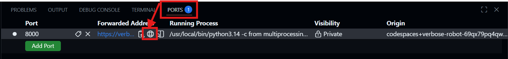

# WIQD Hackathon - Quantum 4 You Website

A website mockup for the WIQD Hackathon on Friday March 13th.

The website is for an organisation that hosts live events for Quantum Education by providing live access to experts who can answer questions from the public. The website is used as a repository of previous events, previously asked questions and to gather new questions for future events.

For fully realising a working final platform the following should be implemented:
- Definition of available tags.
- Automatic tagging of questions for categorization.
- Account system for tracking questions for users.
    - Responding to answers from experts.
    - Listing previous questions.
- Account management for experts and staff.
- Cleaning up the UI/UX
- Better schedule (with calendar).
- Terms and conditions, privacy policy and other similar things.

### Codespace instructions

A devcontainer definition is included to run the website in a codespace. Create a codespace by clicking the "Create codespace on main" button in the image below:


Then wait until the codespace is created and copy the following command into the terminal

```
uvicorn website.main:app --reload
```

The website is now accessible by clicking on the url in the terminal, or by clicking the following icon in the "Ports" tab:

